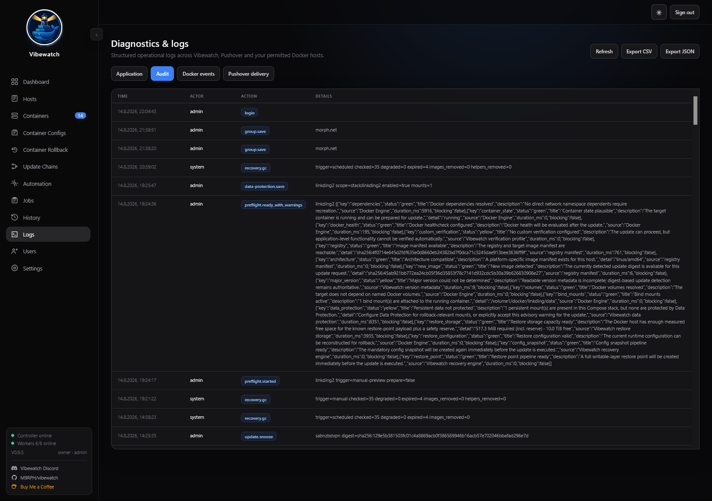

# Vibewatch

**Vibewatch is a multi-host Docker update controller focused on safe, observable and recoverable container updates.**

Instead of only asking whether a new image exists, Vibewatch builds an update pipeline around Preflight checks, restore points, Docker health, custom application verification, ordered Update Chains and rollback.

> **Project status:** v0.9.5 is a pre-1.0 release. It is intended for homelab and self-hosted Docker environments where operators are comfortable reviewing Docker permissions, update policies and recovery behavior before enabling unattended updates.

## Why the name Vibewatch?

**Vibewatch** combines **vibe coding** with **Watchtower**. AI-assisted programming is an intentional part of the development workflow: it helps turn ideas into testable software quickly, while the resulting behavior is still reviewed and exercised against real Docker environments.

The **watch** part also reflects Vibewatch's roots in the Watchtower ecosystem. Vibewatch uses the Nicholas Fedor Watchtower fork as its passive update worker, while Vibewatch itself provides the UI, orchestration, Preflight, Verification, restore-point and rollback logic. The project is open about its AI-assisted development because the tools used to build it are part of how ideas can move from concept to working implementation faster.

## Screenshots

A quick look at the current Vibewatch interface. The screenshots below show a real multi-host setup and the areas used for day-to-day update management, recovery and automation.

<p align="center">
  
  
</p>
<p align="center"><sub>Dashboard · Container inventory and update state</sub></p>

<p align="center">
  
  
</p>
<p align="center"><sub>Hosts & groups · Restore points and rollback</sub></p>

<p align="center">
  
  
</p>
<p align="center"><sub>Ordered Update Chains · Policy and cleanup automation</sub></p>

<p align="center">
  
  
</p>
<p align="center"><sub>Execution jobs · Human-readable update and rollback history</sub></p>

<p align="center">
  
  
</p>
<p align="center"><sub>Diagnostics & audit logs · Users and permissions</sub></p>

## What Vibewatch does

- Manage multiple Docker Engine hosts from one web UI.
- Detect image updates and compare registry digests.
- Apply per-container or stack-level Manual / Auto Update / Excluded policies.
- Run Preflight checks before Docker changes are made.
- Create pre-update restore points with config/runtime state and the container writable layer.
- Optionally protect selected bind mounts and Docker volumes as part of the same restore point.
- Run HTTP/HTTPS/TCP Custom Verification after updates and rollbacks.
- Update complete Compose stacks in an explicit order with Update Chains.
- Automatically roll back failed updates when a valid restore point is available.
- Schedule policy runs and safe Docker cleanup runs.
- Keep update history, jobs, audit events, Docker events and recovery integrity information.
- Connect to local Docker, remote TCP Docker endpoints and Docker TLS/mTLS endpoints.

## What Vibewatch is not

Vibewatch is not a replacement for Portainer, Kubernetes or a general-purpose backup product. Data Protection exists to create **short-lived, update-related recovery points**; important application data should still have an independent backup strategy.

## Requirements

- Docker Engine on the Vibewatch host.
- Docker Compose v2.
- Access to `/var/run/docker.sock` for the local host.
- Remote Docker hosts must already be reachable from the Vibewatch controller. Prefer TLS/mTLS for remote Docker access.
- Supported release images are published for `linux/amd64` and `linux/arm64`.

Vibewatch has powerful Docker permissions. Access to a Docker Engine is effectively privileged host access. Do not expose an unauthenticated Docker TCP socket to untrusted networks.

## Installation

### Docker Compose (recommended)

A source checkout is **not required**. Release images are published to GitHub Container Registry for `linux/amd64` and `linux/arm64`.

Create a directory and download only the release Compose file and environment template:

```bash
mkdir -p vibewatch && cd vibewatch
curl -fsSLo compose.yml https://raw.githubusercontent.com/M9RPH/vibewatch/v0.9.5/compose.yml
curl -fsSLo .env https://raw.githubusercontent.com/M9RPH/vibewatch/v0.9.5/.env.example
```

Set at least these two values in `.env`:

```dotenv
VIBEWATCH_ADMIN_PASSWORD=replace-with-a-strong-password
VIBEWATCH_SESSION_SECRET=replace-with-a-long-random-secret
```

Generate a session secret with:

```bash
openssl rand -hex 32
```

Then start Vibewatch:

```bash
docker compose pull
docker compose up -d
```

Open `http://<docker-host>:8085`. The initial Owner username is `admin`.

The official Compose file uses the release-pinned image:

```text
ghcr.io/m9rph/vibewatch:0.9.5
```

You can also copy `compose.yml` directly into a Portainer Stack and provide the `VIBEWATCH_*` variables through Portainer's environment settings.

### Build from source

Cloning the repository is only required for development or a local source build:

```bash
git clone https://github.com/M9RPH/vibewatch.git
cd vibewatch
cp .env.example scripts/.env
cd scripts
docker compose --env-file .env -f ../docker-compose.yml -f ../docker-compose.build.yml up -d --build
```

## Updating Vibewatch

For a release-pinned installation:

```bash
docker compose pull
docker compose up -d
```

The Compose file in this release defaults to:

```text
ghcr.io/m9rph/vibewatch:0.9.5
```

Vibewatch performs additive SQLite migrations automatically. Before upgrading, keeping an independent copy of the Vibewatch data directory is recommended. Owner Settings can also create a portable application backup bundle.

## Update safety model

A normal protected update follows this flow:

```text
Update detected
  -> Preflight
  -> Restore Point
  -> Image update / recreate
  -> Docker running/health validation
  -> Custom or Stack Verification
  -> Success
       or
     Rollback -> Verification
```

When Data Protection is configured, selected persistent data is captured just before the destructive update phase. Vibewatch does not automatically select every mount; the operator defines which data is rollback-relevant.

Automatic updates require a clean Preflight by default. An operator can explicitly allow advisory warnings, but hard blockers cannot be bypassed by unattended policy runs.

## v0.9.5 recovery safety

v0.9.5 strengthens recovery when the Vibewatch controller restarts during an update:

- update pipeline stages are persisted;
- interrupted single-container updates are reconciled against the real Docker runtime;
- interrupted Update Chains reconcile child update transactions before the chain itself;
- started chain work may be retained or rolled back according to the recorded recovery state;
- unstarted chain steps are **not automatically resumed** after a controller restart;
- unresolved transactions are marked **Recovery required** and block new updates for the affected target;
- orphaned short-lived Vibewatch helper containers are removed only when the host is not performing another destructive operation;
- unusable expired/degraded recovery artifacts can be cleaned explicitly without deleting restore points referenced by active recovery work.

## Documentation

- [Installation and upgrades](docs/INSTALLATION.md)
- [Update pipeline and Preflight](docs/UPDATE_PIPELINE.md)
- [Custom Verification](docs/VERIFICATION.md)
- [Data Protection and rollback](docs/DATA_PROTECTION_AND_ROLLBACK.md)
- [Recovery and crash safety](docs/RECOVERY_AND_CRASH_SAFETY.md)
- [Update Chains](docs/UPDATE_CHAINS.md)
- [Automation and cleanup](docs/AUTOMATION.md)
- [Security model](docs/SECURITY.md)
- [Architecture](ARCHITECTURE.md)
- [Changelog](CHANGELOG.md)

## Support bundles

Owner/Admin diagnostics can export a support bundle containing application state useful for troubleshooting. Credential secrets, Docker TLS private keys and registry passwords are not intentionally exposed through normal support-bundle APIs. Review diagnostic archives before sharing them publicly.

## Community

- GitHub: `M9RPH/vibewatch`
- Discord: `https://discord.gg/ZpXxngq`
- Buy Me a Coffee: `https://buymeacoffee.com/m9rph`

## License

Vibewatch is released under the [MIT License](LICENSE).
