# UI screenshots

These screenshots reflect the current **Web UI v2** and replace the earlier release-preparation images.

## Main pages

| Area | Screenshot |
| --- | --- |
| Dashboard | 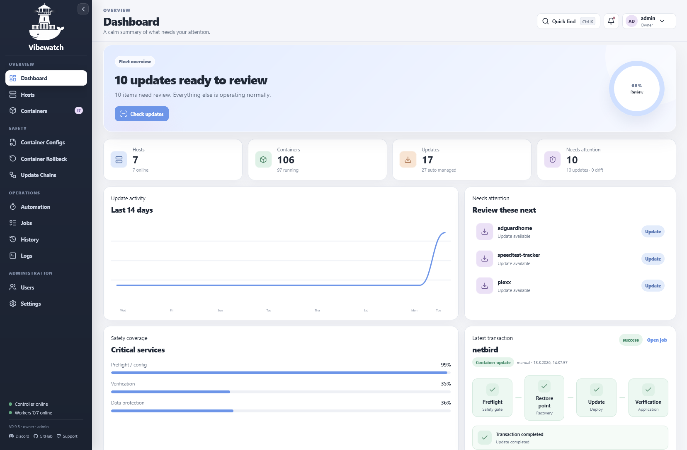 |
| Hosts | 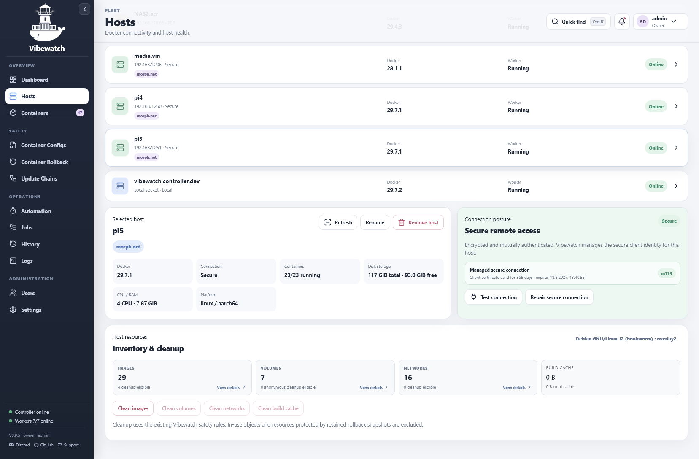 |
| Containers | 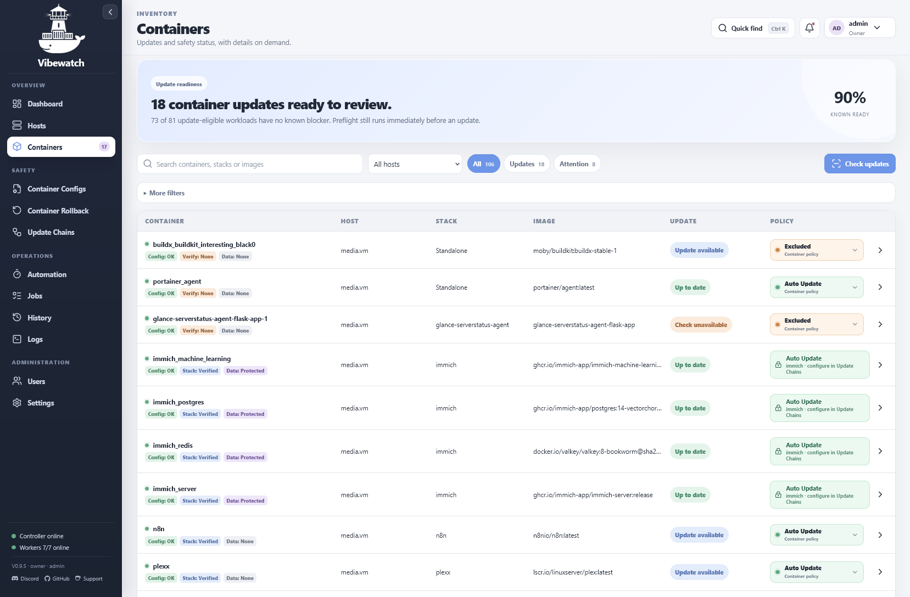 |
| Container Configs | 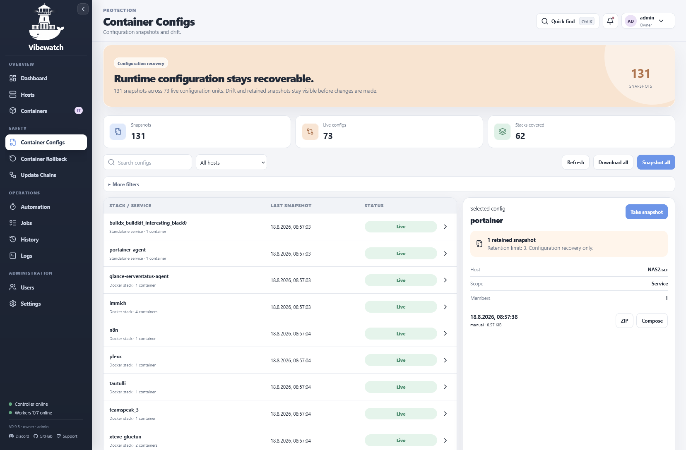 |
| Automation | 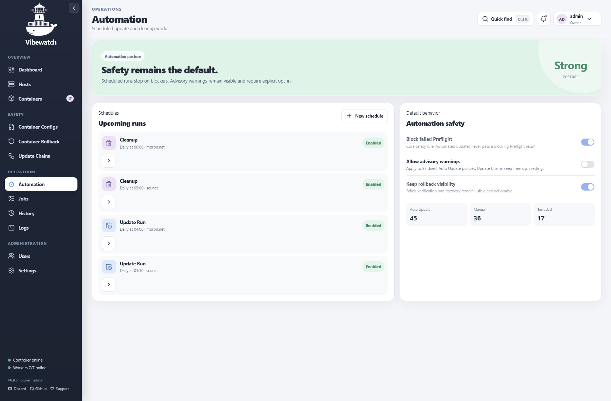 |
| Jobs | 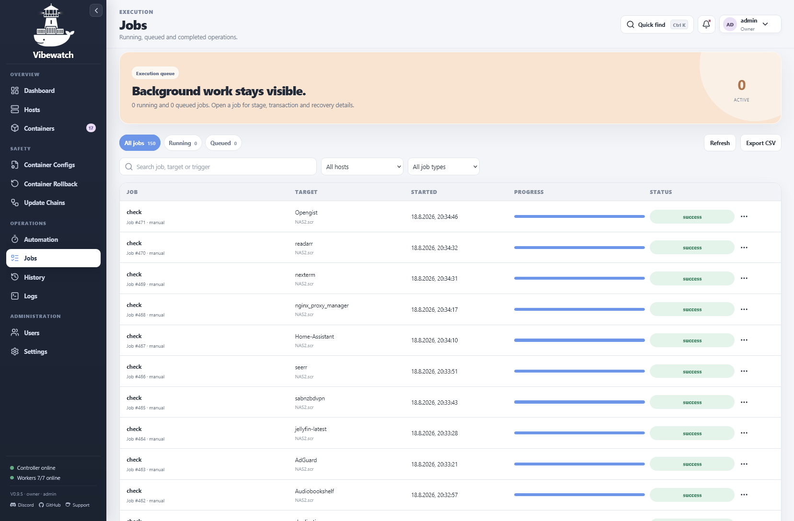 |
| History | 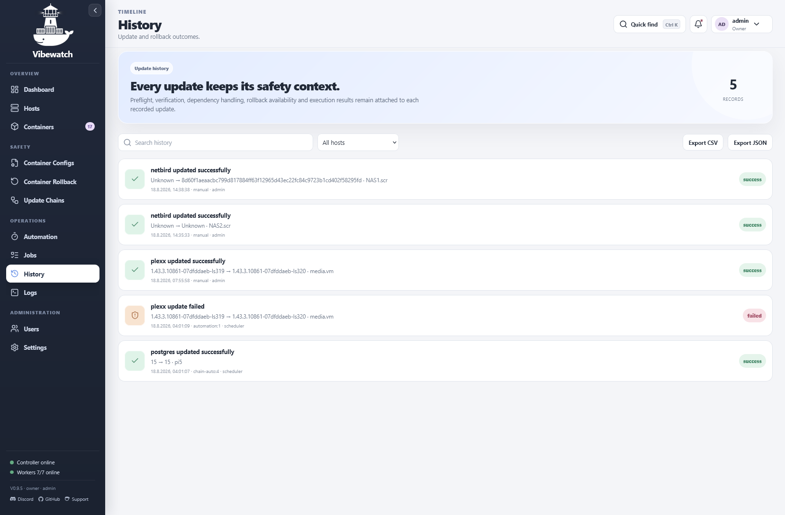 |
| Container Rollback | 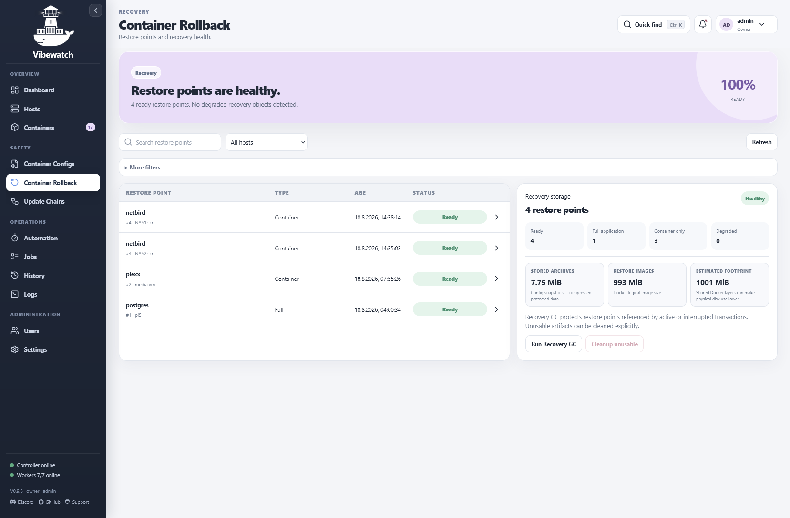 |
| Update Chains | 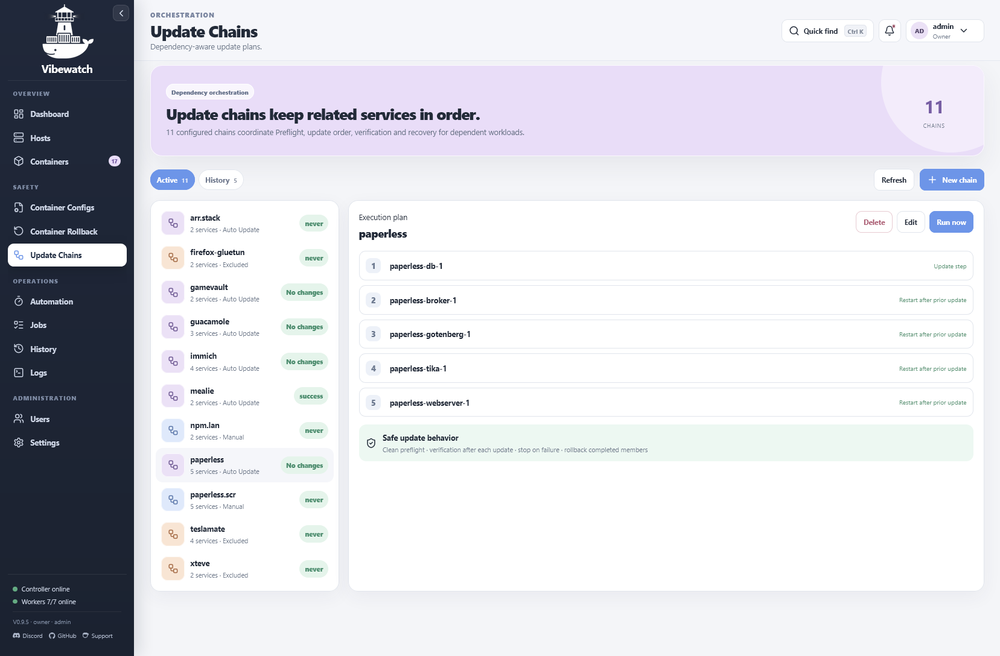 |
| Users | 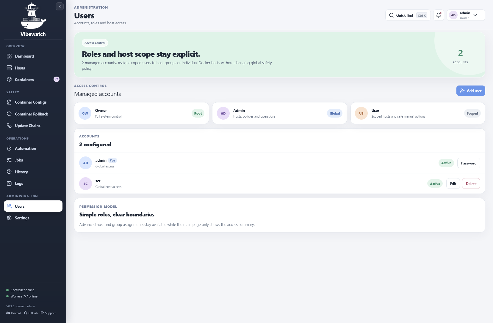 |

## Detailed flows

| Area | Screenshot |
| --- | --- |
| Add Docker host / Secure Quick Setup | 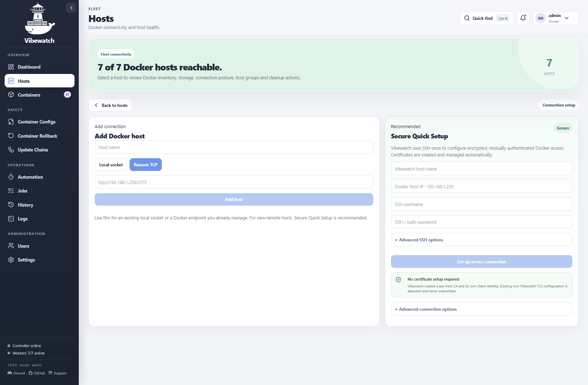 |
| Host detail / inventory & cleanup |  |
| Container Inspector with Data Protection | 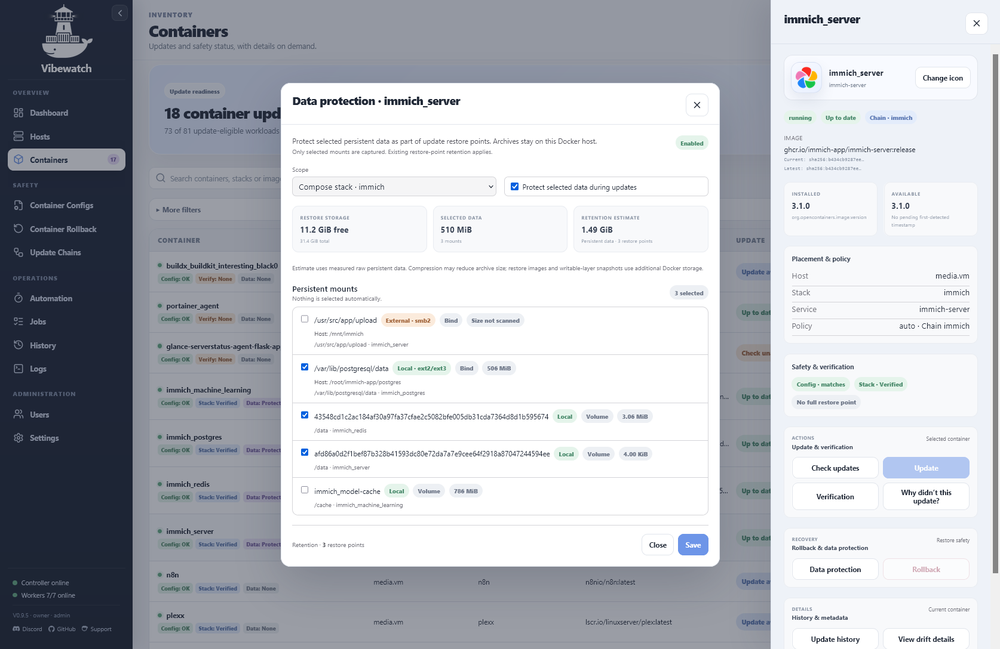 |
| Container Inspector with Verification | 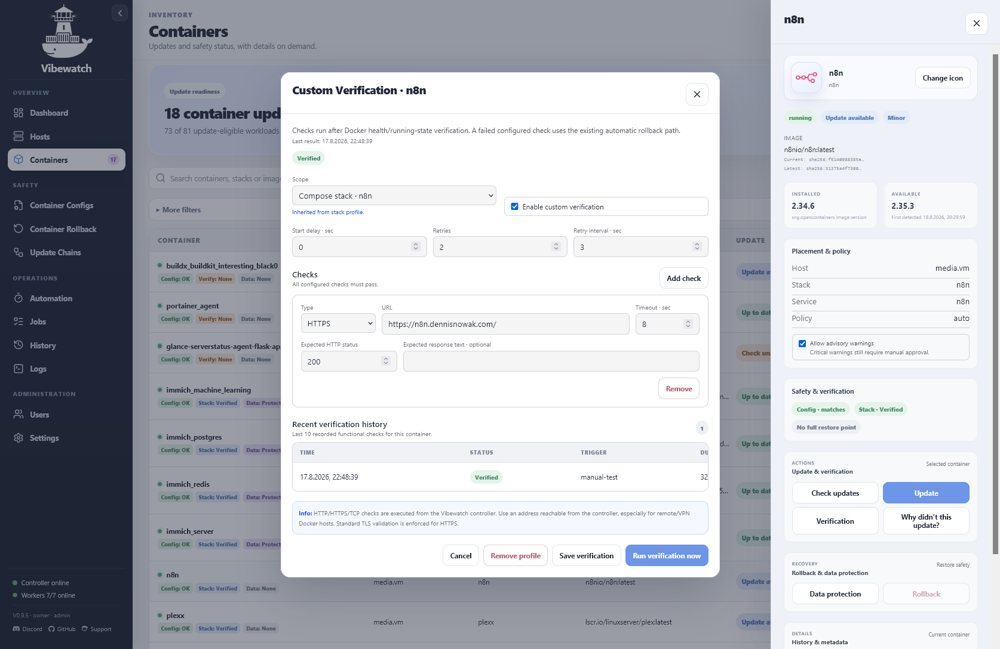 |
| Update Chain editor | 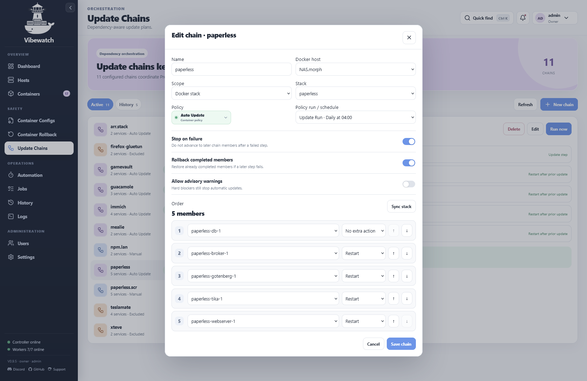 |
